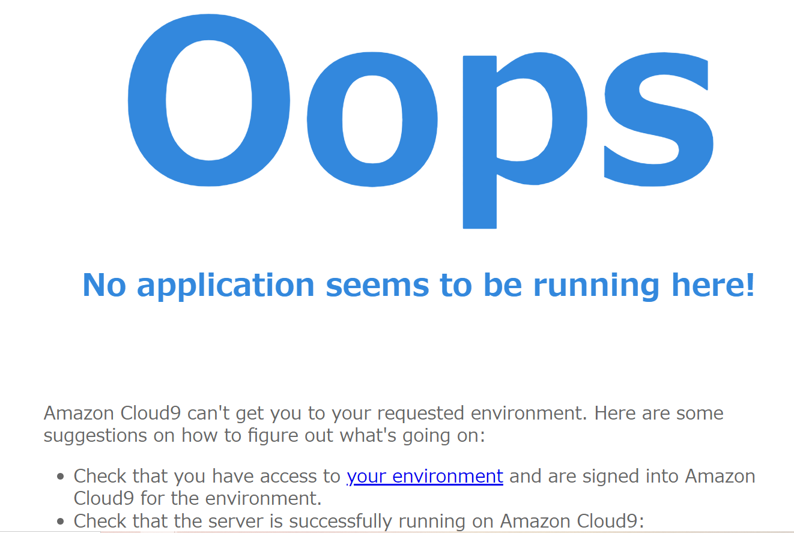
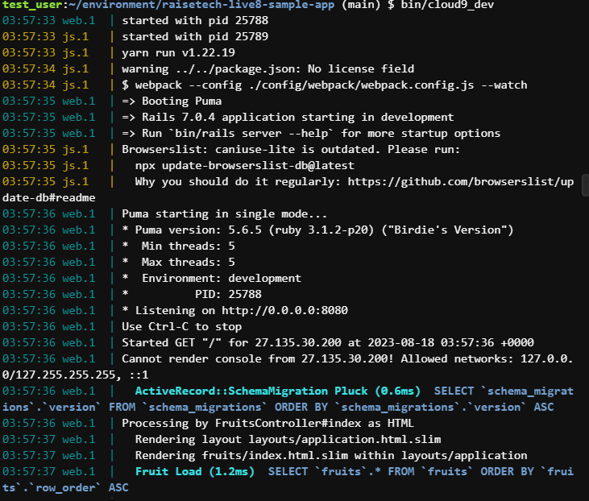
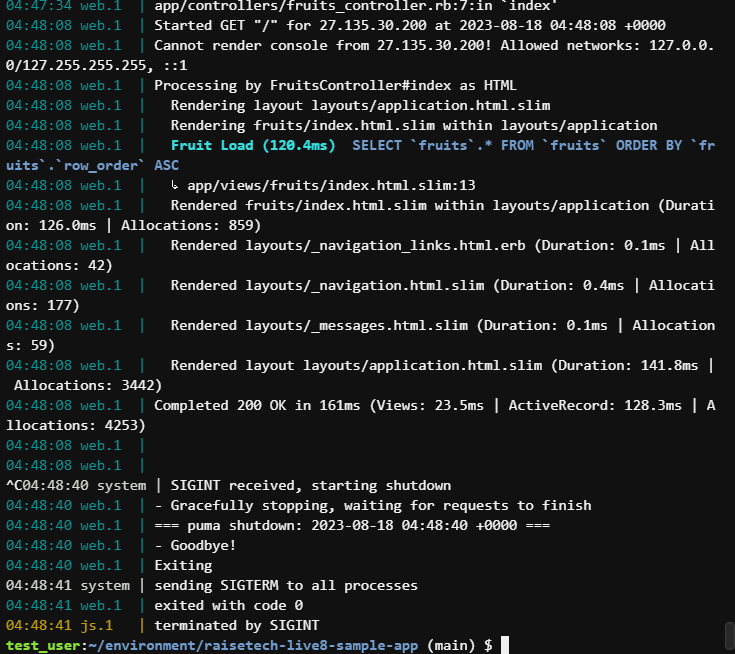
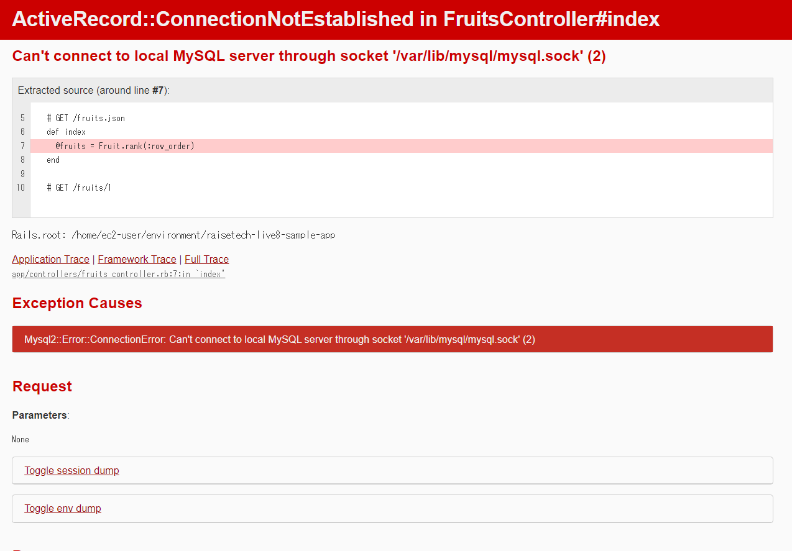
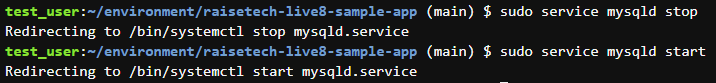

# 第三回課題

- APサーバの名前・バージョン
- ⇒puma version 5.6.5

- APサーバを終了させた場合、引き続きアクセスできるか？
- ⇒アクセスできなかった

- DBサーバの名前・バージョン
- →mysql  Ver 8.0.34 for Linux on x86_64 (MySQL Community Server - GPL)

- DBサーバを終了させた場合、引き続きアクセスできるか？
- ⇒アクセスできなかった

- Railsの構成管理ツールの名前
- ⇒Bundler

- 今回の課題から学んだこと
- アプリケーションサーバ稼働までの流れ、実際の動作、LINUXコマンド