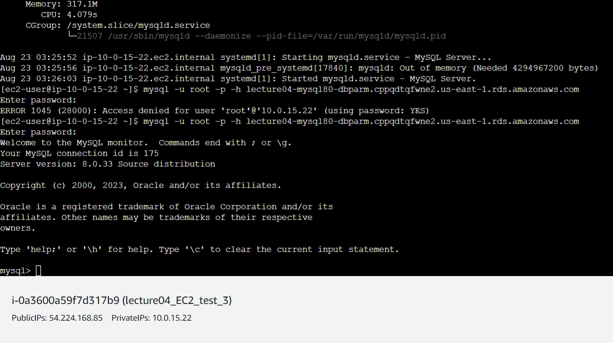
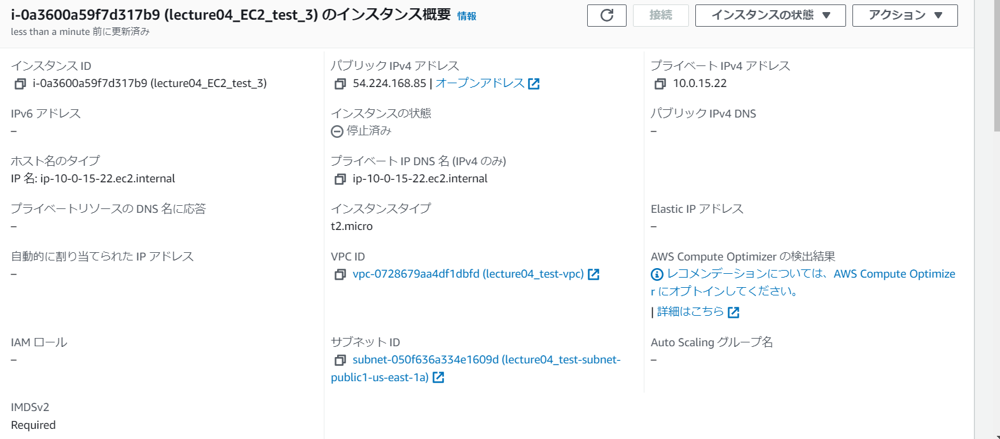

# 第四回課題

- VPCの構築、RDS、EC2の配置を実施。
- EC2に接続しMYSQLをインストール・ログインが可能であることを確認した。

- 今回の課題から学んだこと
- VPCを構築し、その上のパブリックサブネットにEC2、プライベートサブネットにRDSを設置し、
- 適切なルーティングを施すことで接続ができることが分かった。

- 失敗：EC2をデフォルトのVPCに配置してしまったことで、mysqlへのログインがはじかれてしまった。
- （そもそもpingすら飛ばない状況）