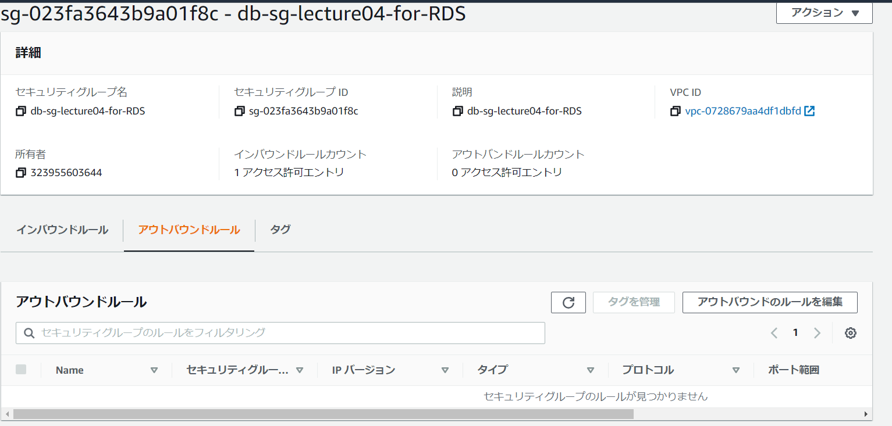

# 第5回課題

- 第4回課題で作成したVPC、RDS、EC2を活用して、第3回課題のサンプルアプリケーションを実装する。
- また、WEBサーバ、アプリケーションサーバ、ELB、S3の導入も行う。

- EC2設定画面

- RDS設定画面

- VPC設定画面

- EC2用セキュリティグループ画面

- RDS用セキュリティグループ画面（インバウンド）

- RDS用セキュリティグループ画面（アウトバウンド）

- ELB設定画面

- ターゲットグループ

- S3設定画面

- S3データ

- S3バケットポリシー

- WEB画面

- AWS構成図

- 今回の課題から学んだこと
- 小さいステップを踏み積み上げていくことの大切さと難しさ。
- 質問することの大切さと難しさ