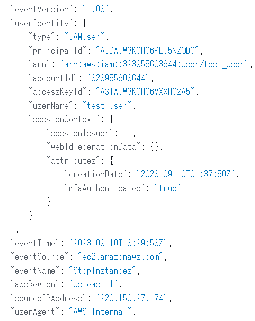
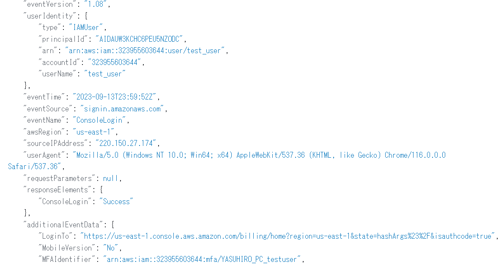
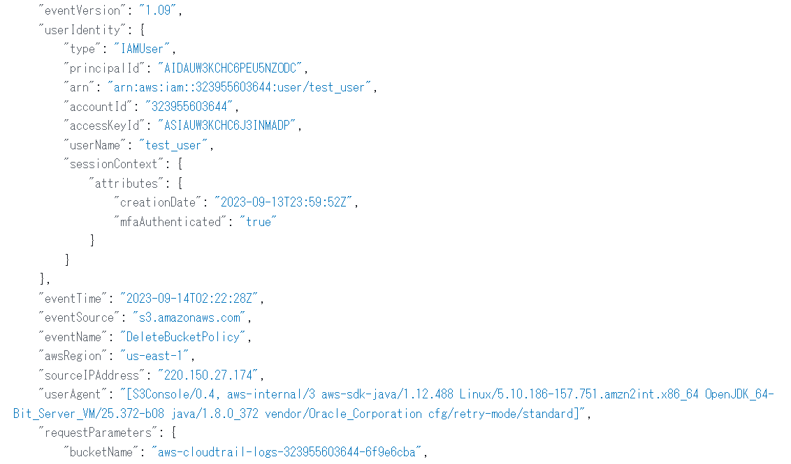
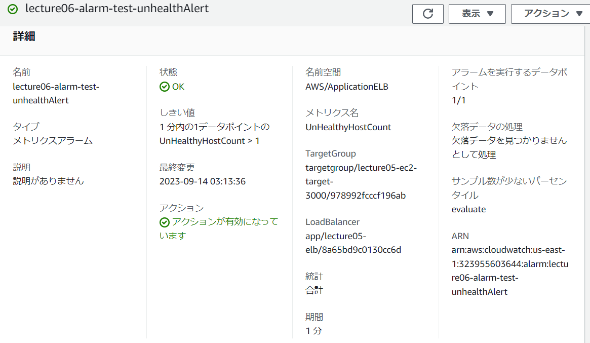
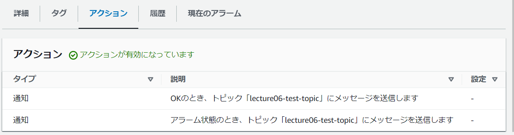
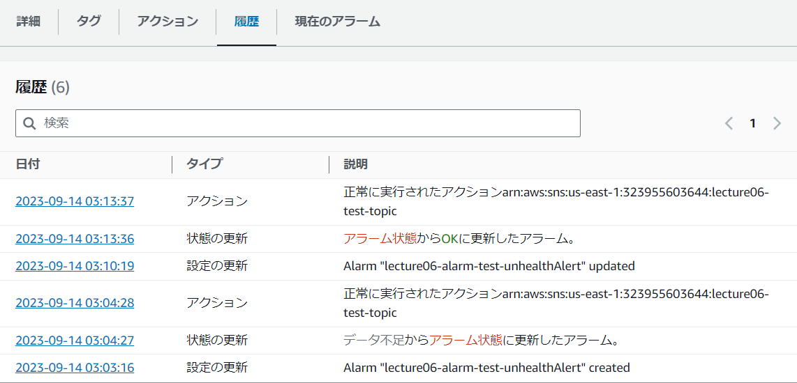

# 第6回課題

- ①CloudTrailのイベントを3つ確認する

- イベント１：StopInstances ⇒ 課題5実施時のインスタンス停止作業

- イベント２：ConsoleLogin ⇒ AWSコンソールへのログイン

- イベント３：DeleteBucketPolicy ⇒ S3バケットのポリシーの削除

- ②CloudWatchアラーム実装＆メール通知

- アラート設定画面

- アラートアクション画面

- アラート履歴画面

- 実際のアラート通知

- ③AWS利用料見積作成

- 見積画像

- 共有パス
[AWS calculator path](https://calculator.aws/#/estimate?id=897620030675032cd874dda65e2610fccb30a865)

- 今回の課題から学んだこと
- AWS意外とお金かかる。特にRDS。
- アラート通知は実態とある程度の時差が発生する。