# 第10回課題

- cloudformationを用いてVPC、EC2、RDS、ALB、S3を構築する。

- cloudformation実行結果
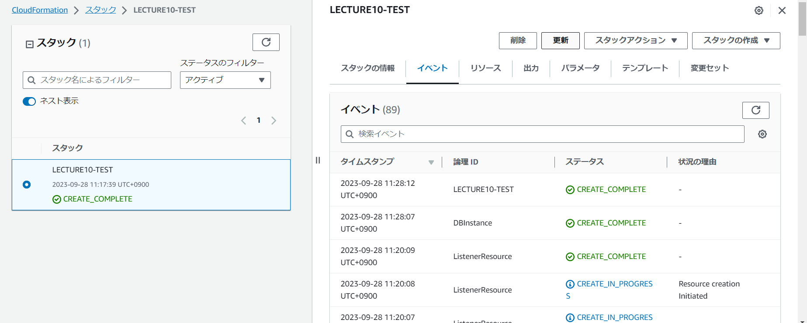

- 構築されたVPC
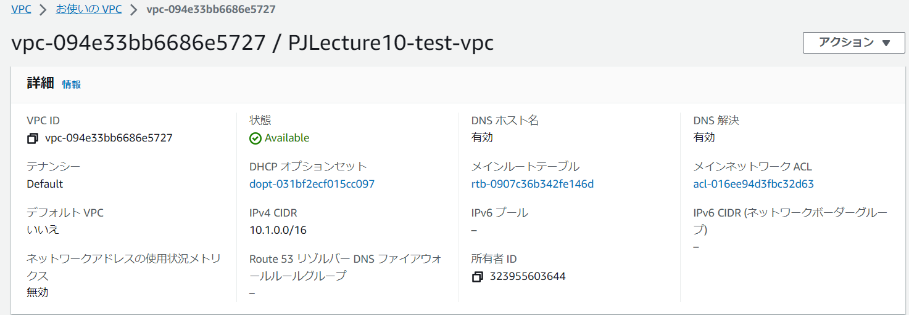

- パブリックサブネットおよびプライベートサブネット

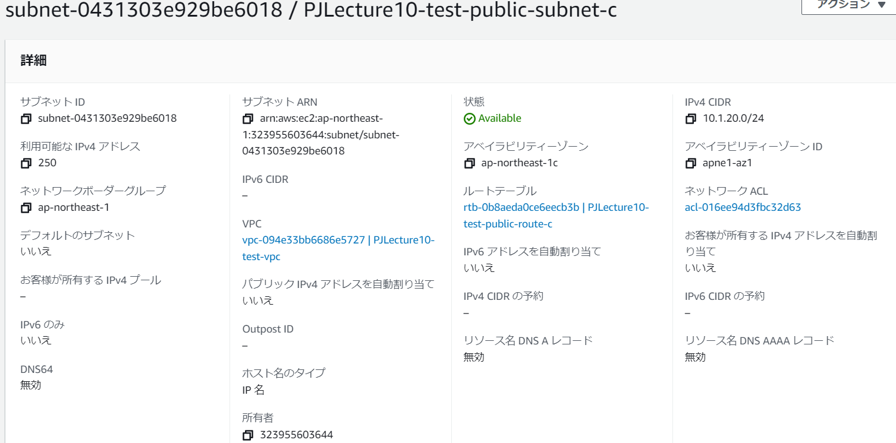
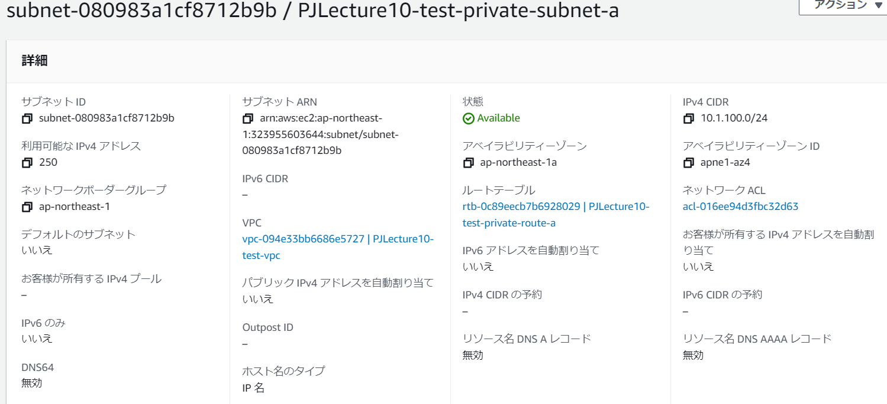
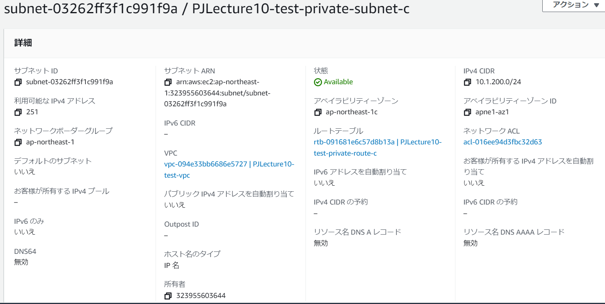

- ルートテーブル
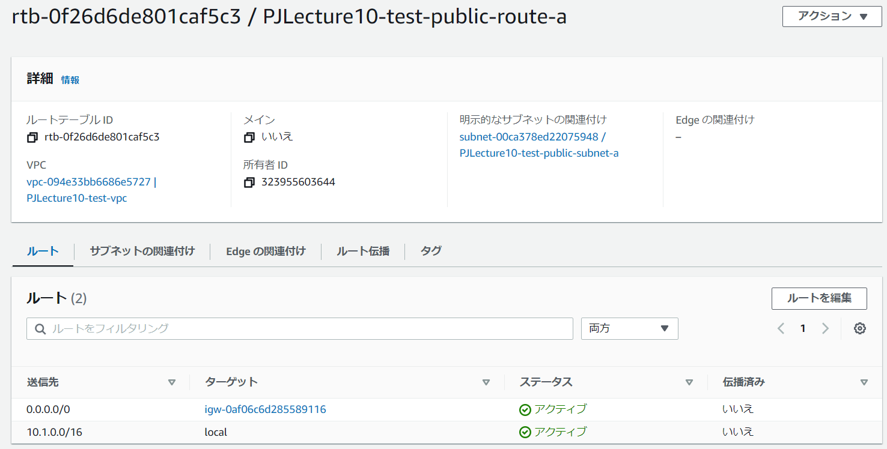
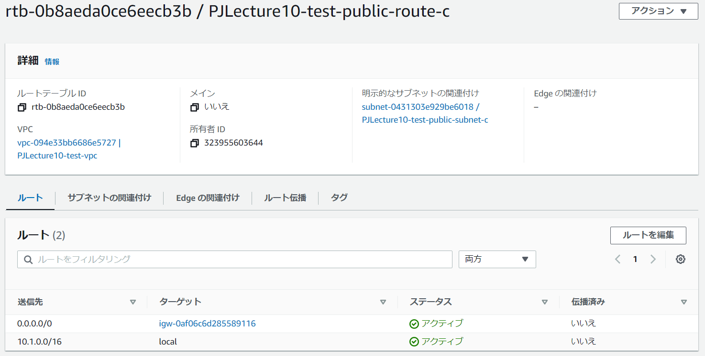
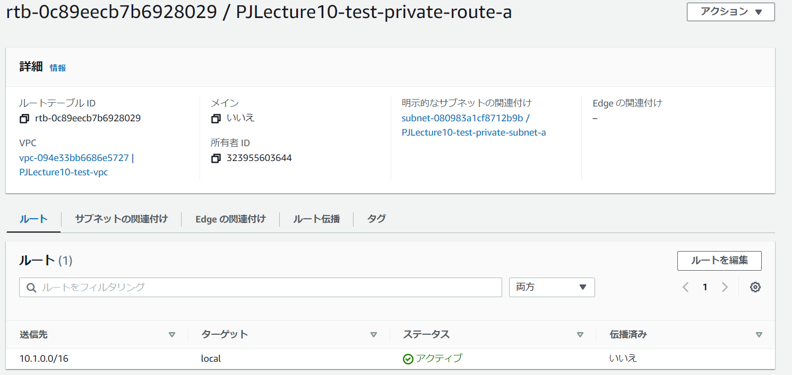

- インターネットゲートウェイ
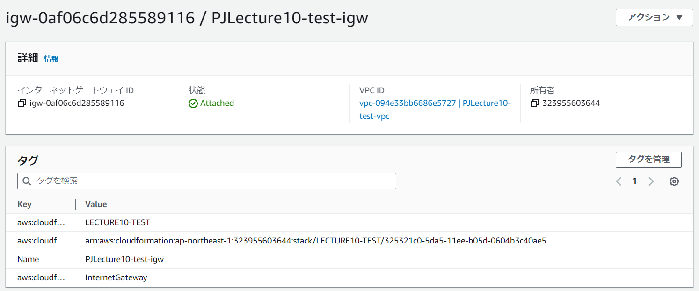

- 構築されたEC2
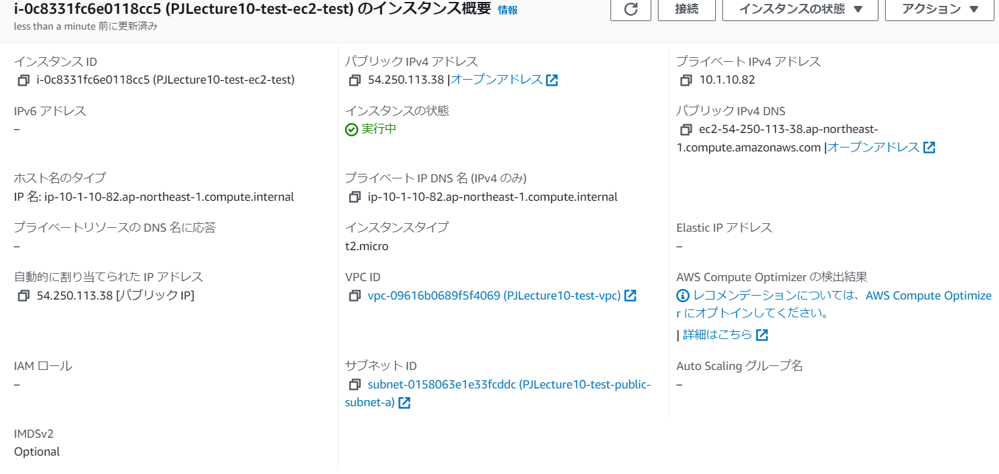

- EC2のインバウンド・アウトバウンド
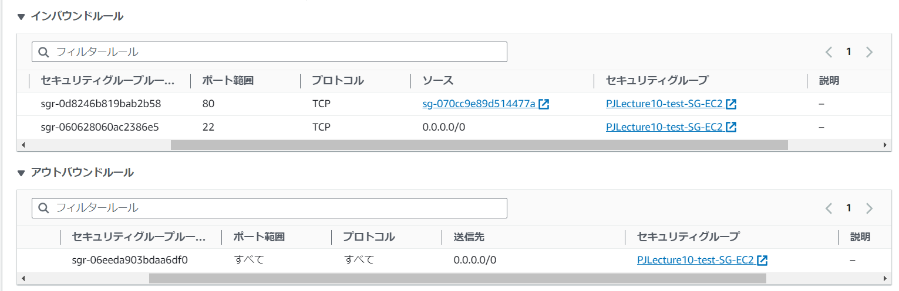

- 構築されたRDS
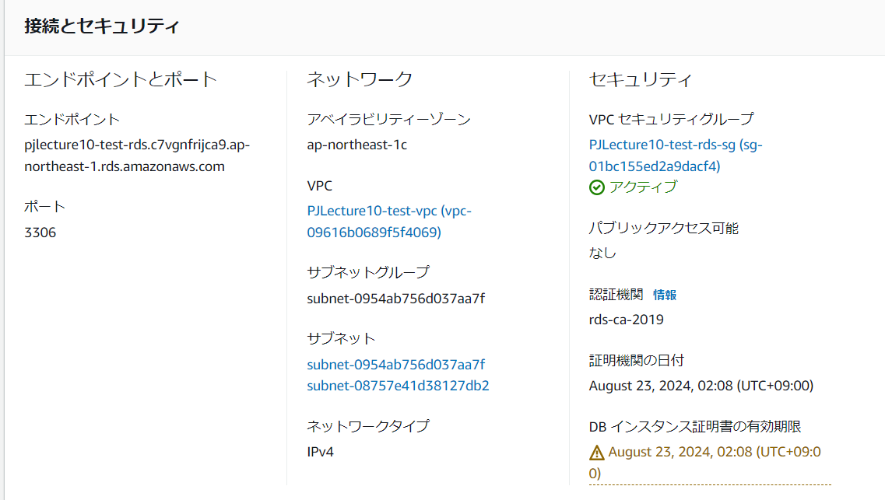

- RDSのインバウンド・アウトバウンド
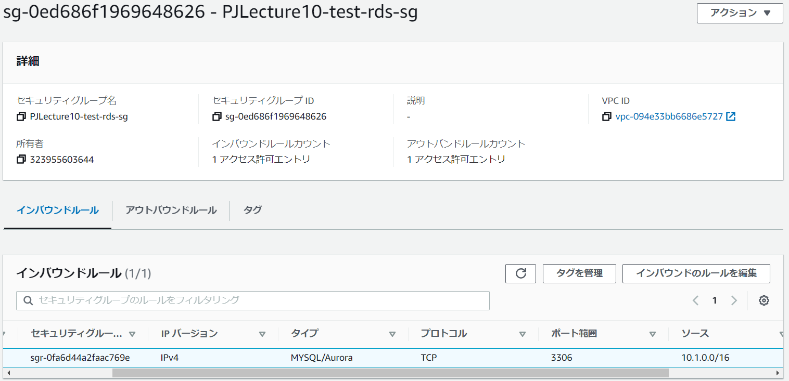
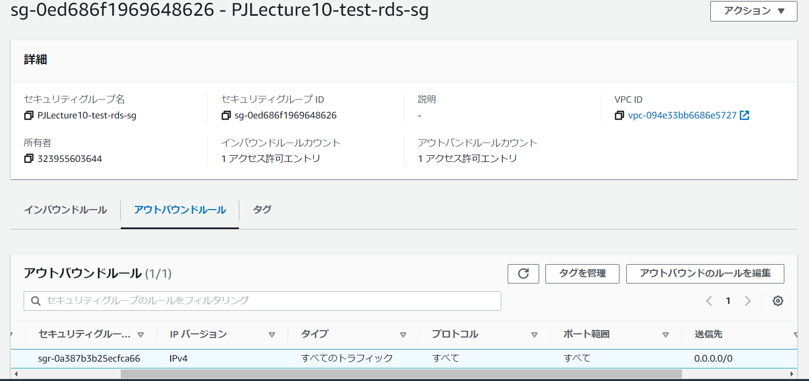

- 構築されたALB
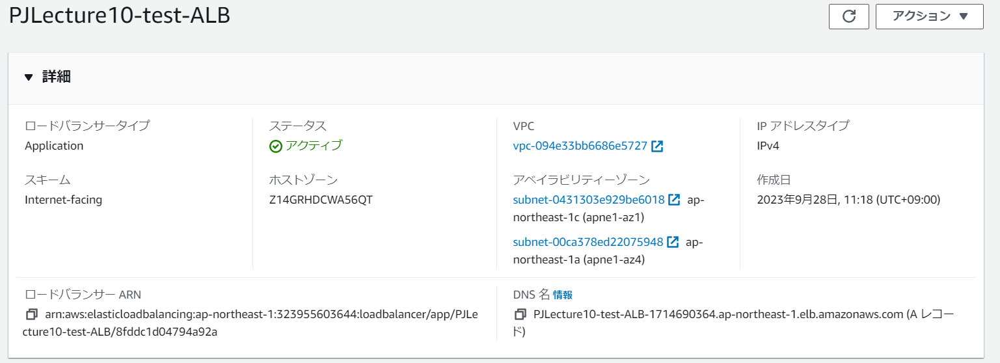

- ALBのインバウンド・アウトバウンド
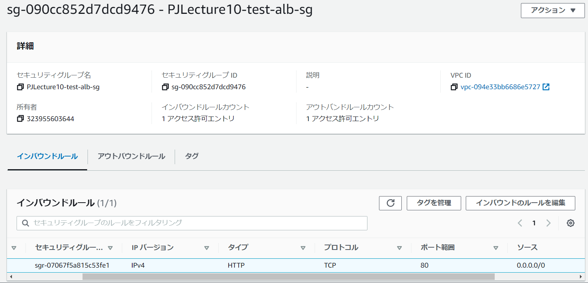
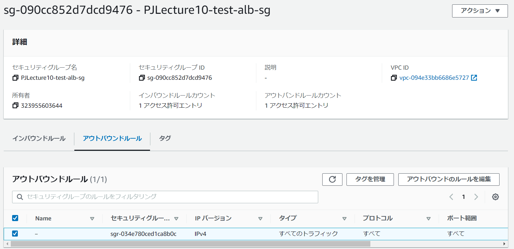

- ALBのリスナールール
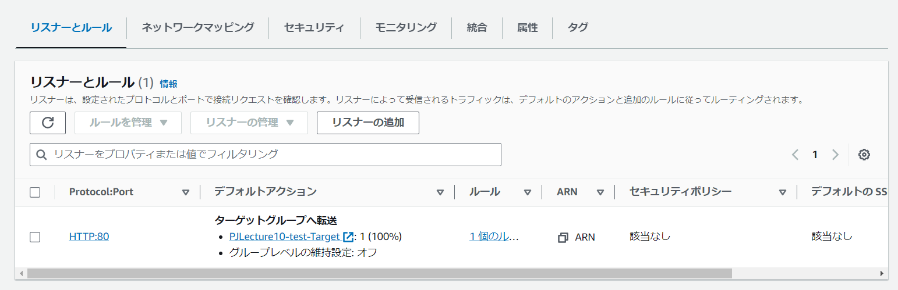

- ALBのネットワーキング
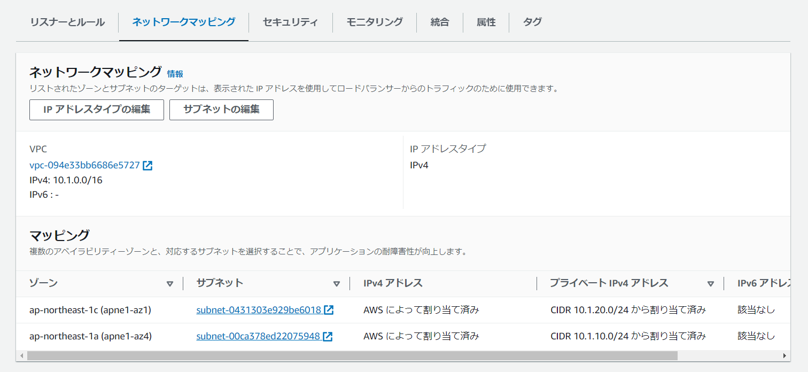

- ターゲットグループ
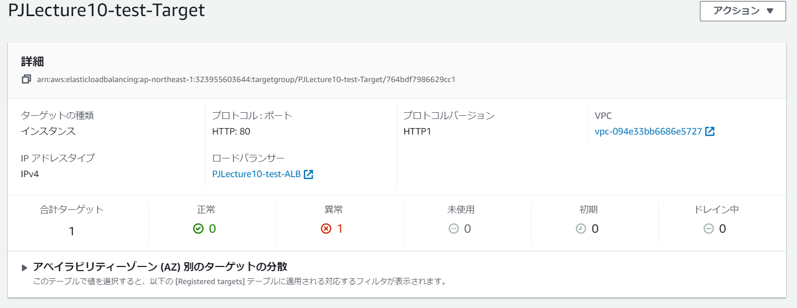

- 構築されたS3
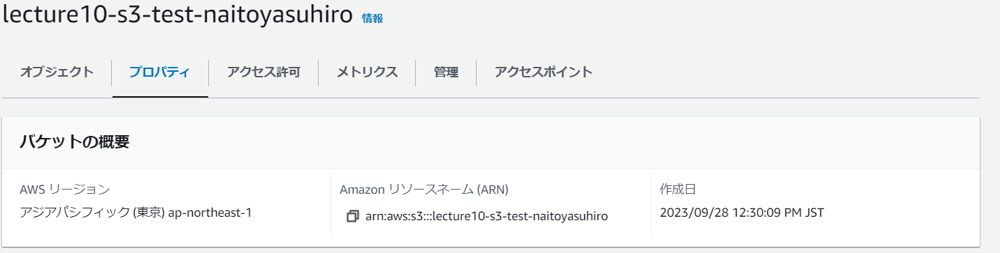

- 実コードは以下参照
[lecture10.yml] (template/lecture10.yml)

- 今回の課題から学んだこと
- RDSの構築に結構時間かかる。
- 一つのテンプレートで作成するとかなり見づらくなる。
- cloudformationの実行ログは内容が分かりにくいようで実のところしっかり読めば分かりやすい。