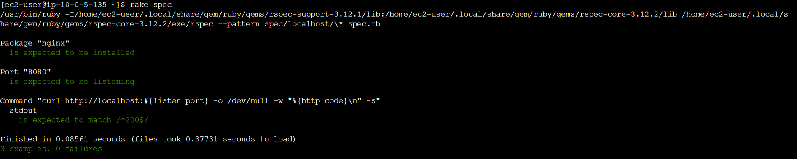

# 第11回課題

- ServerSpecのテストが成功することを確認する。

- EC2にServerspecとNginxをインストールし、localhostに対して試験を実施。

- 下記の通り試験が成功することを確認した。

- 今回の課題から学んだこと
- SSH接続でキーになるのはキーペア。当然のことなんだけど。
- http://127.0.0.1とlocalhostでは名前解決のルートが異なっている様子。
- teratarmの画面にファイルをドラッグするとそのまま接続先のサーバにファイル送信できて便利。
